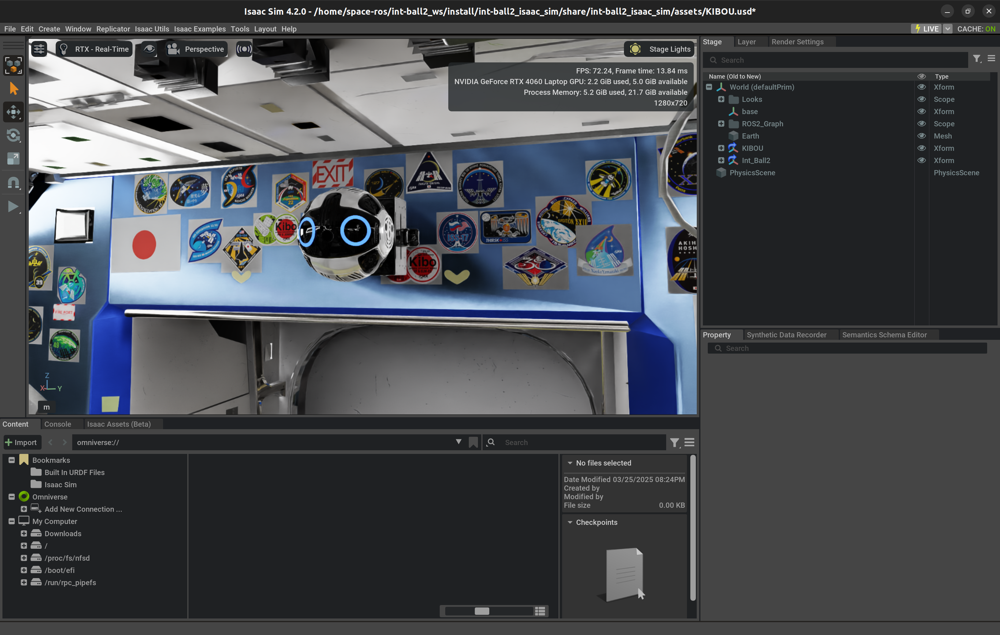
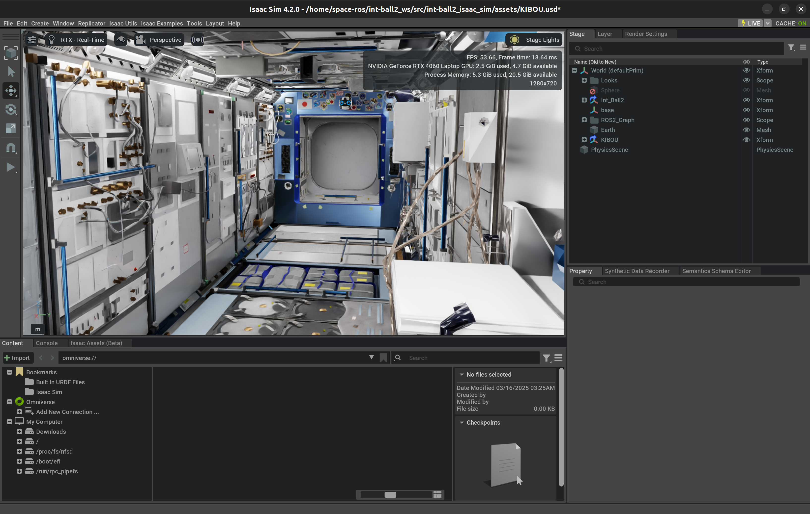
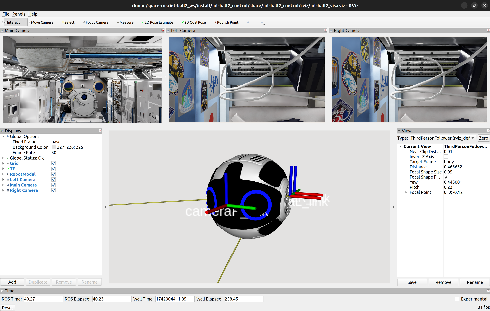

# Int-Ball2シミュレータ (Isaac Sim)

[](./README.md)
[](./README_JA.md)


<p style="display: inline">
    
  
  
  
  
</p>


## 目次
1. [**Int-Ball2シミュレータ (Isaac Sim) とは？**](#int-ball2シミュレータ-isaac-sim-とは)

2. [**前提条件**](#前提条件)

3. [**インストール**](#インストール)
    1. [リポジトリのクローン](#リポジトリのクローン)
    2. [アセットのダウンロードと依存パッケージのインストール](#アセットのダウンロードと依存パッケージのインストール)


4. [**使い方**](#使い方)
    1. [ビルド & ソース](#ビルド--ソース)
    2. [シミュレータの起動方法](#シミュレータの起動方法)
    3. [ROS Bridgeによるデータ取得](#ros-bridgeによるデータ取得)
    4. [遠隔操作 (ジョイコントローラ)](#遠隔操作-ジョイコントローラ)
    5. [ISS上の実機データの再生](#ISS上の実機データの再生)

5. [**データの可視化**](#データの可視化)

6. [**謝辞**](#謝辞)

---

## Int-Ball2シミュレータ (Isaac Sim) とは？
Int-Ball2は、ISSの日本実験棟 (JEM) に配備されたフリーフライング型のカメラロボットです。
地上からの遠隔操作で動画像の撮影を行い、宇宙飛行士をサポートします。
さらに、Int-Ball2は、拡張機能としてユーザーが開発したソフトウェアを実行することができ、
宇宙でのロボット技術を実証するためのプラットフォームとして使用することができます。

このリポジトリでは、Int-Ball2用のROS + Isaac Sim (NVIDIA) ベースのシミュレータを提供します。
ISS/JEM環境におけるInt-Ball2の挙動を、ユーザー開発プログラムでシミュレーションすることができます。


## 前提条件
このリポジトリを使用するには、以下の環境を用意する必要があります。

|  Package  |         Version         |
| --------- | ----------------------- |
|   Ubuntu  | 22.04 (Jammy Jellyfish) |
| Isaac Sim |          4.5.0          |
|    ROS    |     Humble Hawksbill    |
|   Python  |          3.10 <=        |

## インストール
### リポジトリのクローン
まだ、ROS 2のワークスペースがない場合は作成します。
```bash
mkdir -p ~/int-ball2_ws/src
cd ~/int-ball2_ws/src
```

本パッケージをワークスペースにクローンします。
```bash
git clone https://github.com/sd-robotics/int-ball2_isaac_sim.git
```

### アセットのダウンロードと依存パッケージのインストール

プロジェクトまで移動します。
```bash
cd ~/int-ball2_ws/src/int-ball2_isaac_sim
```

アセットをダウンロードと依存パッケージのインストールを行います。

```bash
bash install_local.sh
```

## 使い方
### ビルド & ソース
パッケージのビルドとワークスペースのソースを行います。
```bash
cd ~/int-ball2_ws
colcon build --symlink-install
source install/setup.bash
```

### シミュレータの起動方法
ros2 launchでシミュレータを起動します。
```bash
ros2 launch ib2_isaac_sim int-ball2_isaac_sim.launch.py usd_file:="KIBOU.usd"
```

> [!NOTE]
> `ROS_DOMAIN_ID`が事前にセットアップされていない場合、デフォルトIDが`0`となります。

画面左側にある「▶」ボタンを押すことでIsaac Simのシミュレーションが実行されます。
その後、Isaac Sim内のセンサや推進装置といったROSプログラムが動きます。



視点を変えることで、ISS「きぼう」日本実験棟を見渡すことができます。



> [!TIP]
> Isaac Simを実行するためにノートPCを使用しており、Isaac Simが起動したときにモニターがフリーズする問題に悩まされている場合は、次のコマンドでNVIDIA GPUを使用するようにシステムを切り替えてみてください。
> ```bash
> sudo prime-select nvidia
> ```
>
> これにより、グラフィックを多用するタスクのパフォーマンスが向上します。ラップトップが正常にNVIDIA GPUに切り替わったかどうかを確認するには、次のコマンドを使用できます。
> ```bash
> prime-select query
> ```

### ROS Bridgeによるデータ取得
ユーザープログラムによって取得可能なデータは下記の通りです。

| 種類  |         ROS定義名          |                                 概要                               |
| ----- | ------------------------- | ------------------------------------------------------------------ | 
| Topic | /camera_main/image_raw    | Int-Ball2正面のメインカメラの画像。                                  |
| Topic | /camera_main/camera_info  | Int-Ball2正面のメインカメラに関する情報。                             |
| Topic | /camera_left/image_raw    | Int-Ball2の左側にあるサブカメラ (左) の画像。                         |
| Topic | /camera_left/camera_info  | Int-Ball2の左側にあるサブカメラ (左) に関する情報。                   |
| Topic | /camera_right/image_raw   | Int-Ball2の左側にあるサブカメラ (右) の画像。                         |
| Topic | /camera_right/camera_info | Int-Ball2の左側にあるサブカメラ (右) に関する情報。                   |
| Topic | /imu/imu                  | IMU (慣性計測ユニット) のセンサ値。                                  |
| Topic | /ground_truth             | ロボットの位置と姿勢 (ドッキングステーションからInt-Ball2本体) の真値。 |

ユーザープログラムによって制御可能なデータは下記の通りです。

| 種類  |         ROS定義名          |                                    概要                                    |
| ----- | ------------------------- | ------------------------------------------------------------------------- | 
| Topic | /ctl/wrench               | Int-Ball2 に力とトルクを入力する。Int-Ball2はForceとTorqueによって制御される。 |

### 遠隔操作 (ジョイコントローラ)
ワークスペースをソースします。
```bash
cd ~/int-ball2_ws
source install/setup.bash
```

コマンドを実行する前に、ジョイスティック・コントローラがPCに接続されていることを確認します。
次にテレオペ (ジョイスティック・コントローラでの操作) のプログラムを起動します。
```bash
ros2 launch int-ball2_control int-ball2_teleop.launch.py
```

ジョイスティック・コントローラでの操作は下記のとおりです。

並進移動の場合：
- X軸とY軸：左スティックで、
- Z軸：Bボタン＋RTまたはLT。

回転移動：
- X軸とY軸：右スティックで、
- Z軸：Aボタン＋RTまたはLT。


### ISS上の実機データの再生
SpaceDataは、ISS上の実機Int-Ball2のデータを収集する機会を得ました。
これらのROSBagsは[HuggingFace](https://huggingface.co/datasets/SpaceData/int-ball2_data_on_iss)で公開されており、本シミュレータ上でも再生することができます。

1. まず、[HuggingFace CLI](https://huggingface.co/docs/huggingface_hub/main/ja/guides/cli)を使ってROSBagsデータをダウンロードします。
```bash
cd ~/int-ball2_ws/src/int-ball2_isaac_sim/int-ball2_data_replay/
# ダウンロードしたいROSBagsを選択してください
huggingface-cli download --repo-type dataset --local-dir ./ SpaceData/int-ball2_data_on_iss bags/rosbag_20250421111514.bag
```
2. 実機Int-Ball2はROS Melodicで動作しているため、[Rosbags](https://gitlab.com/ternaris/rosbags)を使ってROS2で再生できる形式に変換します。
```bash
cd bags/
rosbags-convert --src rosbag_20250421111514.bag --dst-storage sqlite3 --dst ./rosbag2_20250421111514
```
3. 変換したROSBagsを使ってIsaac Simを起動します。
```bash
ros2 launch ib2_isaac_sim int-ball2_issbag_demo.launch.py bag_file:="<ABSOLUTE/PATH/TO/ROSBAG>"
```


## データの可視化
ワークスペースをソースします。
```bash
cd ~/int-ball2_ws
source install/setup.bash
```

Rvizを起動します。
```bash
ros2 launch int-ball2_control rviz_visualize.launch.py 
```



## 引用
本プラットフォームを研究に使用する場合は、以下のように引用してください。
```
[1] SpaceData Inc., 2025, int-ball2_isaac_sim (Version v1.0.0) [Source code], GitHub, Available at: https://github.com/sd-robotics/int-ball2_isaac_sim.
```

## 謝辞
このシミュレータは、宇宙イノベーションパートナーシップ（J-SPARC：JAXA Space Innovation through Partnership and Co-creation）の枠組みの中で、株式会社スペースデータがJAXAと協力して開発したものです。

> [!TIP]
> この文書は、Apache License 2.0の下でライセンスされているJAXAのInt-Ball2シミュレータの内容を含んでいます。
> - [Int-Ball2 Simulator (Gazebo)](https://github.com/jaxa/int-ball2_simulator)

---

[トップに戻る](#int-ball2シミュレータ-isaac-sim)
